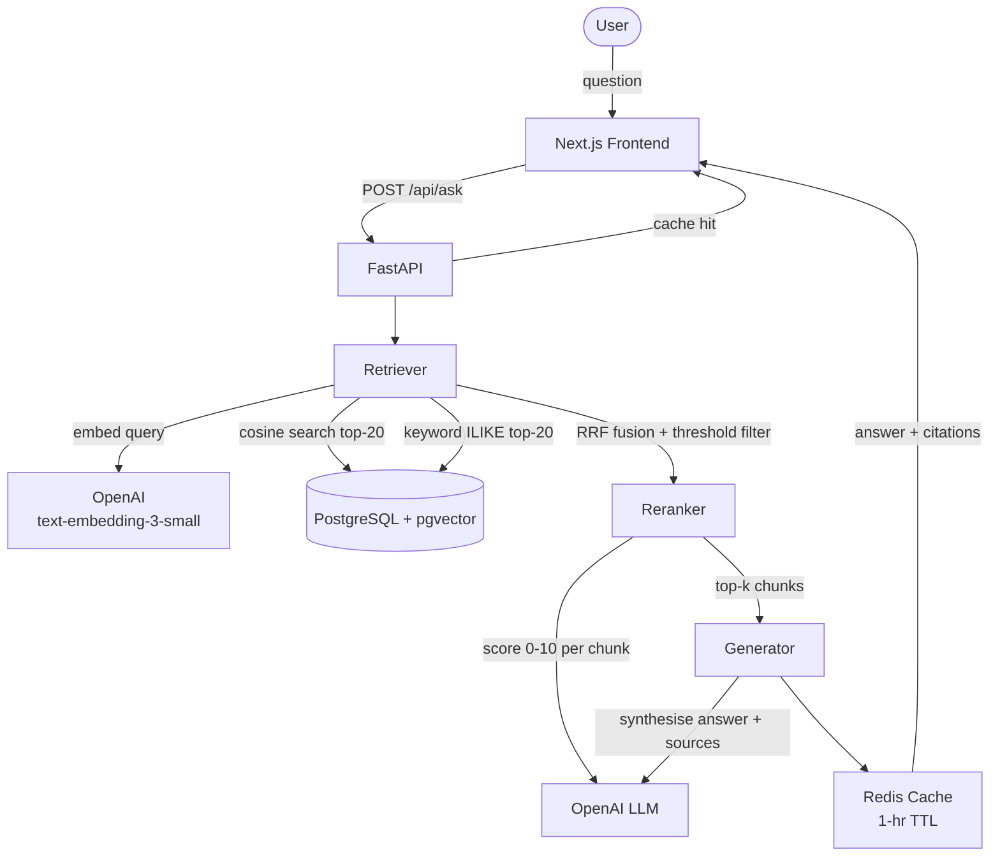

# Scientific RAG Assistant

A retrieval-augmented generation (RAG) system for question-answering over scientific papers. Ask natural-language questions and get grounded, cited answers backed by a multi-stage retrieval pipeline.

Browsing and querying the paper library is open to everyone. Uploading or deleting papers requires signing in with Google.

---

## Architecture



**Query pipeline:**
1. Check Redis cache (SHA-256 key, 1-hour TTL)
2. Embed query — OpenAI `text-embedding-3-small`, 1536-dim
3. Dense search — cosine similarity, top-20 candidates from pgvector
4. Keyword search — `ILIKE`, top-20 candidates
5. RRF fusion — merge both lists by reciprocal rank
6. Similarity threshold filter (≥ 0.3); fallback to top-k if none pass
7. LLM reranker — score each chunk 0–10 for relevance
8. LLM generator — synthesise grounded answer with inline source numbers
9. Store in Redis, return with citations

---

## Tech Stack

| Layer | Technology |
|-------|-----------|
| Frontend | Next.js, React 18, Tailwind CSS, TypeScript, Lora (serif) |
| Backend API | FastAPI + Uvicorn |
| Auth | Google OAuth 2.0 (ID token) + JWT (python-jose) |
| Embeddings | OpenAI `text-embedding-3-small` (1536-dim) |
| LLM | OpenAI `gpt-4o-mini` |
| Vector DB | PostgreSQL 16 + pgvector |
| Cache | Redis 7 |
| ORM | SQLAlchemy 2 |
| PDF parsing | PyMuPDF |
| Chunking | LangChain `RecursiveCharacterTextSplitter` |

---

## Prerequisites

- [Docker Desktop](https://www.docker.com/products/docker-desktop/)
- Python 3.11+
- Node.js 18+
- OpenAI API key
- Google Cloud project with an OAuth 2.0 Web Client ID (see [Auth Setup](#auth-setup))

---

## Auth Setup

The app uses **Google Sign-In**. You need a Google OAuth 2.0 client ID before running.

1. Go to [Google Cloud Console](https://console.cloud.google.com) → **APIs & Services → Credentials**
2. Click **Create Credentials → OAuth 2.0 Client ID**, choose **Web application**
3. Under **Authorized JavaScript origins**, add:
   - `http://localhost:3000` (Docker / local frontend)
   - `http://localhost:3001` (if running `next dev` on port 3001)
   - `http://YOUR_VM_IP:3000` (for VM deployment)
4. Copy the **Client ID** — it looks like `123456789-abc.apps.googleusercontent.com`

---

## Quick Start

Two ways to run: **Docker Compose** (recommended) or **local dev** (faster iteration).

---

### Option A — Docker Compose (full stack)

```bash
git clone <repo-url>
cd scientific-rag-assistant

# 1. Configure secrets
cp .env.example .env
```

Edit `.env` and fill in:

```bash
OPENAI_API_KEY=sk-...
GOOGLE_CLIENT_ID=your-client-id.apps.googleusercontent.com
NEXT_PUBLIC_GOOGLE_CLIENT_ID=your-client-id.apps.googleusercontent.com
JWT_SECRET_KEY=<generate: python -c "import secrets; print(secrets.token_hex(32))">
```

```bash
# 2. Build and start all services
docker compose up --build
```

| Service | URL |
|---------|-----|
| Frontend | http://localhost:3000 |
| API | http://localhost:8000 |
| API docs | http://localhost:8000/docs |
| PostgreSQL | localhost:5732 |
| Redis | localhost:6380 |

To ingest pre-existing PDFs from `data/raw/`:

```bash
# Requires a valid JWT — use the Upload button in the UI instead,
# or call the endpoint with a Bearer token from a signed-in session.
curl -X POST http://localhost:8000/api/ingest \
  -H "Authorization: Bearer <your-jwt>"
```

---

### Option B — Local development

```bash
git clone <repo-url>
cd scientific-rag-assistant
cp .env.example .env
# fill in OPENAI_API_KEY, GOOGLE_CLIENT_ID, JWT_SECRET_KEY in .env
```

#### 1. Start infrastructure only

```bash
docker compose up -d db redis
```

#### 2. Install Python dependencies

```bash
python -m venv .venv

# Windows
.venv\Scripts\activate
# macOS / Linux
source .venv/bin/activate

pip install -r requirements.txt
```

#### 3. Start the API

```bash
uvicorn main:app --reload
```

#### 4. Configure and start the frontend

```bash
cd frontend
cp .env.example .env.local
# fill in NEXT_PUBLIC_GOOGLE_CLIENT_ID in .env.local
npm install
npm run dev
```

Frontend: `http://localhost:3000` (or `3001` if 3000 is in use)

#### 5. Ingest papers (optional)

Place PDFs in `data/raw/`, then use the **Upload Paper** button in the UI, or run the script directly:

```bash
python scripts/ingest_all.py            # ingest all new PDFs
python scripts/ingest_all.py --dry-run  # preview what would be ingested
```

---

## VM / Production Deployment

Extra steps needed when running on a server rather than localhost.

### 1. Add the VM's address to Google Cloud Console

In your OAuth client's **Authorized JavaScript origins**, add:
```
http://YOUR_VM_IP:3000
```

### 2. Add VM-specific vars to `.env`

```bash
# URL the browser uses to reach the API (baked into the Next.js bundle at build time)
NEXT_PUBLIC_API_URL=http://YOUR_VM_IP:8000

# Comma-separated list of CORS origins the backend will accept
ALLOWED_ORIGINS=http://YOUR_VM_IP:3000
```

### 3. Migrate the database (existing deployments only)

If your PostgreSQL volume already has data from before auth was added, the `users` table won't exist. Create it once:

```sql
CREATE TABLE IF NOT EXISTS users (
    id          SERIAL PRIMARY KEY,
    google_sub  TEXT UNIQUE NOT NULL,
    email       TEXT UNIQUE NOT NULL,
    name        TEXT,
    picture     TEXT,
    created_at  TIMESTAMPTZ DEFAULT NOW()
);
```

### 4. Build and start

```bash
docker compose up --build
```

---

## Environment Variables

| Variable | Where | Required | Description |
|----------|-------|----------|-------------|
| `OPENAI_API_KEY` | root `.env` | Yes | OpenAI API key for embeddings and generation |
| `GOOGLE_CLIENT_ID` | root `.env` | Yes | Google OAuth client ID (backend token verification) |
| `JWT_SECRET_KEY` | root `.env` | Yes | Secret for signing JWTs — use a random 32-byte hex string |
| `NEXT_PUBLIC_GOOGLE_CLIENT_ID` | root `.env` + `frontend/.env.local` | Yes | Same client ID, exposed to the browser bundle |
| `NEXT_PUBLIC_API_URL` | root `.env` | VM only | URL the browser uses to reach the API (default: `http://localhost:8000`) |
| `ALLOWED_ORIGINS` | root `.env` | VM only | Comma-separated CORS origins (default: localhost:3000/3001) |
| `JWT_EXPIRE_HOURS` | root `.env` | No | JWT lifetime in hours (default: `168` = 1 week) |
| `CACHE_TTL_SECONDS` | root `.env` | No | Redis answer cache TTL (default: `3600`) |
| `GENERATION_MODEL` | root `.env` | No | LLM for answer generation (default: `gpt-4o-mini`) |
| `RETRIEVAL_FINAL_K` | root `.env` | No | Number of chunks to retrieve (default: `5`) |

> `frontend/.env.local` is **not committed** (git-ignored). Create it from `frontend/.env.example`.

---

## API Reference

### Authentication

Endpoints marked **🔒 Auth required** expect a JWT in the `Authorization` header:

```
Authorization: Bearer <token>
```

A token is returned by `POST /api/auth/google` after a successful Google sign-in.

---

### `POST /api/auth/google`

Exchange a Google ID token (from the browser's Google Sign-In flow) for a JWT.

**Request body**

```json
{ "credential": "<Google ID token>" }
```

**Response**

```json
{
  "access_token": "<jwt>",
  "token_type": "bearer",
  "user": { "email": "user@example.com", "name": "Jane Smith", "picture": "https://..." }
}
```

---

### `GET /api/auth/me` 🔒

Return the currently authenticated user's profile.

```json
{ "id": 1, "email": "user@example.com", "name": "Jane Smith", "picture": "https://..." }
```

---

### `POST /api/ask`

Ask a question over the indexed papers. No authentication required.

**Request body**

```json
{
  "question": "How do transformer models handle long-range dependencies?",
  "k": 5
}
```

| Field | Type | Default | Description |
|-------|------|---------|-------------|
| `question` | string | required | Natural-language question |
| `k` | int 1–20 | 5 | Number of chunks to retrieve and cite |

**Response**

```json
{
  "answer": "Transformer models handle long-range dependencies through self-attention [1]...",
  "unsupported": false,
  "citations": [
    {
      "source_number": 1,
      "chunk_id": "paper_003_chunk_0012",
      "paper_id": "paper_003",
      "file_name": "attention_is_all_you_need.pdf",
      "preview": "The attention mechanism allows the model to..."
    }
  ],
  "from_cache": false,
  "request_id": "550e8400-e29b-41d4-a716-446655440000"
}
```

When `unsupported: true`, the papers did not contain sufficient evidence and `citations` will be empty.

---

### `POST /api/upload` 🔒

Upload a PDF to be chunked, embedded, and indexed. Returns 200 if already indexed, 201 on success.

**Request:** `multipart/form-data` with a single `file` field (PDF only, max 50 MB).

**Response (201)**

```json
{
  "message": "'paper.pdf' uploaded and ingested successfully.",
  "result": { "file": "paper.pdf", "paper_id": "paper_004", "chunks": 38 }
}
```

---

### `GET /api/papers`

List all papers currently indexed. No authentication required.

**Response**

```json
[
  { "paper_id": "paper_001", "file_name": "sparse_autoencoders.pdf", "is_session_upload": false },
  { "paper_id": "paper_004", "file_name": "uploaded_draft.pdf",      "is_session_upload": true  }
]
```

`is_session_upload: true` means the paper was uploaded this session and will be removed on next server restart.

---

### `DELETE /api/papers/{paper_id}` 🔒

Remove a paper and all its chunks from the database.

**Response**

```json
{ "paper_id": "paper_004", "deleted_file": "uploaded_draft.pdf" }
```

---

### `POST /api/ingest` 🔒

Trigger bulk ingestion of all PDFs in `data/raw/`. Already-indexed files are skipped.

**Response**

```json
{
  "message": "Ingested 3 paper(s), skipped 1, failed 0.",
  "result": {
    "ingested": [{ "file": "paper.pdf", "paper_id": "paper_002", "chunks": 54 }],
    "skipped": ["already_indexed.pdf"],
    "failed": []
  }
}
```

---

### `DELETE /api/uploads/cleanup` 🔒

Delete all session-uploaded PDFs and remove their chunks. Called automatically on server startup.

**Response**

```json
{ "deleted_files": ["uploaded_draft.pdf"], "count": 1 }
```

---

### `GET /health`

Check liveness and dependency health. No authentication required.

**Response**

```json
{
  "status": "ok",
  "uptime_seconds": 142.3,
  "checks": {
    "database": { "status": "ok" },
    "openai":   { "status": "ok" },
    "redis":    { "status": "ok" }
  }
}
```

`status` is `"degraded"` if any dependency check fails.

---

## Evaluation

```bash
python scripts/eval_retrieval.py   # Hit@K and MRR
python scripts/eval_reranker.py    # baseline vs reranked comparison
```

| Metric | Score |
|--------|-------|
| Hit@5 | — |
| MRR | — |
| Avg Faithfulness | — |
| Avg Answer Relevance | — |
| Avg Context Relevance | — |

---

## Running Tests

```bash
pip install -r requirements-dev.txt
pytest tests/ -v
```

---

## Project Structure

```
scientific-rag-assistant/
├── app/
│   ├── api/
│   │   ├── ask.py            # POST /api/ask (public)
│   │   ├── health.py         # GET /health
│   │   ├── ingest.py         # POST /api/ingest (auth required)
│   │   └── upload.py         # POST /api/upload, GET /api/papers, DELETE /api/papers/:id
│   ├── auth/
│   │   ├── dependencies.py   # get_current_user FastAPI dependency (JWT verification)
│   │   └── router.py         # POST /api/auth/google, GET /api/auth/me
│   ├── core/
│   │   └── config.py         # Pydantic settings (env-driven, including auth + CORS)
│   ├── db/
│   │   └── session.py        # SQLAlchemy engine + SessionLocal
│   ├── schemas/
│   │   └── ask.py            # AskRequest / AskResponse / Citation
│   └── services/
│       ├── cache.py          # Redis answer cache (1-hr TTL)
│       ├── chunker.py        # PDF → text chunks via PyMuPDF + LangChain
│       ├── embedder.py       # OpenAI embedding client
│       ├── evaluator.py      # LLM-based RAG quality evaluator
│       ├── generator.py      # LLM answer synthesis with citations
│       ├── pipeline.py       # End-to-end ingestion pipeline
│       ├── reranker.py       # LLM chunk relevance scorer (0–10)
│       └── retriever.py      # pgvector dense + keyword search + RRF fusion
├── frontend/
│   └── app/
│       ├── contexts/
│       │   └── AuthContext.tsx   # Google auth state, JWT storage, login/logout
│       ├── login/
│       │   └── page.tsx          # Sign-in page (Google One Tap)
│       ├── components/
│       │   └── UploadModal.tsx   # PDF upload modal (auth-gated)
│       └── page.tsx              # Main chat UI
├── data/
│   ├── raw/                  # Source PDFs for bulk ingest
│   └── uploads/              # Session uploads (auto-cleaned on restart)
├── scripts/
│   ├── eval_retrieval.py
│   ├── eval_reranker.py
│   └── ingest_all.py
├── tests/
├── Dockerfile                # FastAPI container image
├── docker-compose.yml        # Full stack orchestration
├── .env.example              # Environment variable reference
├── init.sql                  # DB schema: chunks + users tables + pgvector indexes
├── main.py                   # FastAPI entry point + CORS + startup cleanup
├── requirements.txt
└── requirements-dev.txt
```
