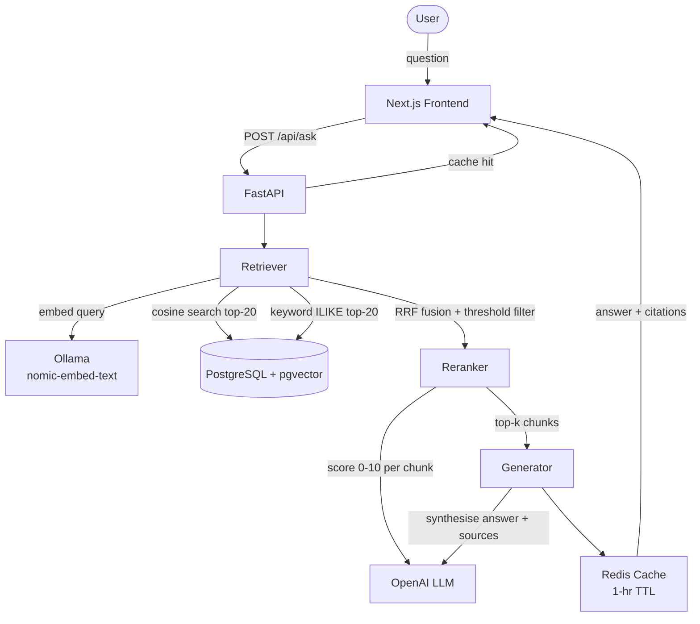

# Scientific RAG Assistant

A retrieval-augmented generation (RAG) system for question-answering over scientific papers. Ask natural-language questions and get grounded, cited answers backed by a multi-stage retrieval pipeline.

---

## Architecture



**Query pipeline:**
1. Check Redis cache (SHA-256 key, 1-hour TTL)
2. Embed query — Ollama `nomic-embed-text`, 768-dim
3. Dense search — cosine similarity, top-20 candidates from pgvector
4. Keyword search — `ILIKE`, top-20 candidates
5. RRF fusion — merge both lists by reciprocal rank
6. Similarity threshold filter (≥ 0.3); fallback to top-k if none pass
7. LLM reranker — score each chunk 0–10 for relevance
8. LLM generator — synthesise grounded answer with inline source numbers
9. Store in Redis, return with citations

---

## Tech Stack

| Layer | Technology |
|-------|-----------|
| Frontend | Next.js, React 18, Tailwind CSS, TypeScript, Lora (serif) |
| Backend API | FastAPI + Uvicorn |
| Embeddings | Ollama `nomic-embed-text` (local, 768-dim) |
| LLM | OpenAI `gpt-4o-mini` |
| Vector DB | PostgreSQL 16 + pgvector |
| Cache | Redis 7 |
| ORM | SQLAlchemy 2 |
| PDF parsing | PyMuPDF |
| Chunking | LangChain `RecursiveCharacterTextSplitter` |

---

## Prerequisites

- [Docker Desktop](https://www.docker.com/products/docker-desktop/)
- Python 3.11+
- Node.js 18+
- [Ollama](https://ollama.com/) installed and running
- OpenAI API key

---

## Quick Start

Two ways to run the project: **Docker Compose** (recommended, one command) or **local dev** (faster iteration).

---

### Option A — Docker Compose (full stack)

> Requires: Docker Desktop, Ollama running on the host, OpenAI API key.

```bash
git clone <repo-url>
cd scientific-rag-assistant

# 1. Configure secrets
cp .env.example .env
# → open .env and set OPENAI_API_KEY=sk-...

# 2. Pull the embedding model on your host
ollama pull nomic-embed-text

# 3. Build and start all services
docker compose up --build
```

| Service | URL |
|---------|-----|
| Frontend | http://localhost:3000 |
| API | http://localhost:8000 |
| API docs | http://localhost:8000/docs |
| PostgreSQL | localhost:5732 |
| Redis | localhost:6379 |

On **Linux**, Docker containers cannot reach the host via `host.docker.internal`. Edit `docker-compose.yml` and change:
```yaml
OLLAMA_HOST: http://172.17.0.1:11434
```

To ingest pre-existing PDFs from `data/raw/` into a running container:

```bash
# Trigger ingestion via the API
curl -X POST http://localhost:8000/api/ingest

# Or run the script directly inside the container
docker compose exec api python scripts/ingest_all.py
```

Or use the **Upload Paper** button in the frontend — it handles chunking, embedding, and indexing automatically.

---

### Option B — Local development

```bash
git clone <repo-url>
cd scientific-rag-assistant
cp .env.example .env
# edit .env and add your OPENAI_API_KEY
```

#### 1. Start infrastructure only

```bash
docker compose up -d db redis
```

Starts PostgreSQL 16 + pgvector on port 5732 and Redis 7 on port 6379.

#### 2. Pull the embedding model

```bash
ollama pull nomic-embed-text
```

#### 3. Install Python dependencies

```bash
python -m venv .venv

# Windows
.venv\Scripts\activate
# macOS / Linux
source .venv/bin/activate

pip install -r requirements.txt
```

#### 4. Ingest papers

Place PDFs in `data/raw/`, then run:

```bash
python scripts/ingest_all.py
```

This chunks each PDF, generates embeddings via Ollama, and upserts all chunks into PostgreSQL. Already-indexed files are skipped automatically.

Alternatively, trigger ingestion via the API after the server is running:

```bash
curl -X POST http://localhost:8000/api/ingest
```

#### 5. Start the API

```bash
uvicorn main:app --reload
```

- API: `http://localhost:8000`
- Interactive docs: `http://localhost:8000/docs`

#### 6. Start the frontend

```bash
cd frontend
npm install
npm run dev
```

Frontend: `http://localhost:3000`

---

## API Reference

### `POST /api/ask`

Ask a question over the indexed papers.

**Request body**

```json
{
  "question": "How do transformer models handle long-range dependencies?",
  "k": 5
}
```

| Field | Type | Default | Description |
|-------|------|---------|-------------|
| `question` | string | required | Natural-language question |
| `k` | int 1–20 | 5 | Number of chunks to retrieve and cite |

**Response**

```json
{
  "answer": "Transformer models handle long-range dependencies through self-attention [1]...",
  "unsupported": false,
  "citations": [
    {
      "source_number": 1,
      "chunk_id": "paper_003_chunk_0012",
      "paper_id": "paper_003",
      "file_name": "attention_is_all_you_need.pdf",
      "preview": "The attention mechanism allows the model to..."
    }
  ],
  "from_cache": false,
  "request_id": "550e8400-e29b-41d4-a716-446655440000"
}
```

When `unsupported: true`, the indexed papers did not contain sufficient evidence. `citations` will be empty.

---

### `POST /api/upload`

Upload a PDF to be chunked, embedded, and indexed immediately. Returns 200 if the file was already indexed, 201 on successful ingestion.

**Request:** `multipart/form-data` with a single `file` field (PDF only, max 50 MB).

**Response (201)**

```json
{
  "message": "'attention_is_all_you_need.pdf' uploaded and ingested successfully.",
  "result": {
    "file": "attention_is_all_you_need.pdf",
    "paper_id": "paper_004",
    "chunks": 38
  }
}
```

---

### `GET /api/papers`

List all papers currently indexed in the database.

**Response**

```json
[
  {
    "paper_id": "paper_001",
    "file_name": "sparse_autoencoders.pdf",
    "is_session_upload": false
  },
  {
    "paper_id": "paper_004",
    "file_name": "uploaded_draft.pdf",
    "is_session_upload": true
  }
]
```

`is_session_upload: true` means the paper was uploaded via the frontend this session and will be removed on next server restart.

---

### `POST /api/ingest`

Trigger bulk ingestion of all PDFs found in `data/raw/`. Already-indexed files are skipped.

**Response**

```json
{
  "message": "Ingested 3 paper(s), skipped 1, failed 0.",
  "result": {
    "ingested": [{ "file": "paper.pdf", "paper_id": "paper_002", "chunks": 54 }],
    "skipped": ["already_indexed.pdf"],
    "failed": []
  }
}
```

---

### `DELETE /api/uploads/cleanup`

Delete all session-uploaded PDFs and remove their chunks from the database. Called automatically on server startup.

**Response**

```json
{
  "deleted_files": ["uploaded_draft.pdf"],
  "count": 1
}
```

---

### `GET /health`

Check liveness and all dependencies.

**Response**

```json
{
  "status": "ok",
  "uptime_seconds": 142.3,
  "checks": {
    "database": { "status": "ok" },
    "ollama":   { "status": "ok" },
    "redis":    { "status": "ok" }
  }
}
```

`status` is `"degraded"` if any dependency check fails. Individual checks include a `"detail"` field explaining the failure.

---

## Evaluation

### Retrieval — Hit@K and MRR

```bash
python scripts/eval_retrieval.py
```

### Reranker — baseline vs reranked comparison

```bash
python scripts/eval_reranker.py
```

| Metric | Score |
|--------|-------|
| Hit@5 | — |
| MRR | — |
| Avg Faithfulness | — |
| Avg Answer Relevance | — |
| Avg Context Relevance | — |

> Run the eval scripts and fill in the table before sharing the project.

---

## Running Tests

```bash
pip install -r requirements-dev.txt
pytest tests/ -v
```

Test files cover: API endpoints, caching, chunking, evaluation, generation, reranking, and retrieval.

---

## Project Structure

```
scientific-rag-assistant/
├── app/
│   ├── api/
│   │   ├── ask.py            # POST /api/ask
│   │   ├── health.py         # GET /health
│   │   ├── ingest.py         # POST /api/ingest — bulk ingest data/raw/
│   │   └── upload.py         # POST /api/upload, GET /api/papers, DELETE /api/uploads/cleanup
│   ├── core/
│   │   └── config.py         # Pydantic settings (env-driven)
│   ├── db/
│   │   └── session.py        # SQLAlchemy engine + SessionLocal
│   ├── prompts/
│   │   ├── answer_prompt.txt       # Generator system prompt
│   │   └── query_rewrite_prompt.txt # Query rewriting prompt
│   ├── schemas/
│   │   └── ask.py            # AskRequest / AskResponse / Citation
│   └── services/
│       ├── cache.py          # Redis answer cache (1-hr TTL)
│       ├── chunker.py        # PDF → text chunks via PyMuPDF + LangChain
│       ├── embedder.py       # Ollama embedding client
│       ├── evaluator.py      # LLM-based RAG quality evaluator
│       ├── generator.py      # LLM answer synthesis with citations
│       ├── pipeline.py       # End-to-end ingestion pipeline (chunk → embed → upsert)
│       ├── reranker.py       # LLM chunk relevance scorer (0–10)
│       └── retriever.py      # pgvector dense search + keyword search + RRF fusion
├── data/
│   ├── raw/                  # Source PDF papers (place files here for bulk ingest)
│   ├── uploads/              # Session-uploaded PDFs (auto-cleaned on restart)
│   └── parsed/
│       └── chunks.jsonl      # Pre-chunked text (generated by chunker)
├── eval/
│   └── retrieval_eval.json   # Evaluation questions + expected papers
├── frontend/                 # Next.js app — warm academic UI (Lora serif, sidebar, footnote citations)
├── scripts/
│   ├── embed_chunks.py       # Standalone batch embedding script
│   ├── eval_retrieval.py     # Hit@K / MRR metrics
│   ├── eval_reranker.py      # Reranker comparison
│   └── ingest_all.py         # Ingest all PDFs in data/raw/ (chunk + embed + upsert)
├── tests/
│   ├── test_api.py
│   ├── test_cache.py
│   ├── test_chunker.py
│   ├── test_evaluator.py
│   ├── test_generator.py
│   ├── test_reranker.py
│   └── test_retriever.py
├── Dockerfile                # FastAPI container image
├── docker-compose.yml        # Full stack: API + frontend + PostgreSQL + Redis
├── .dockerignore
├── .env.example              # Environment variable reference
├── init.sql                  # DB schema (chunks table + pgvector indexes)
├── main.py                   # FastAPI entry point + CORS + startup cleanup
├── requirements.txt          # Runtime dependencies
└── requirements-dev.txt      # Test/dev dependencies
```
